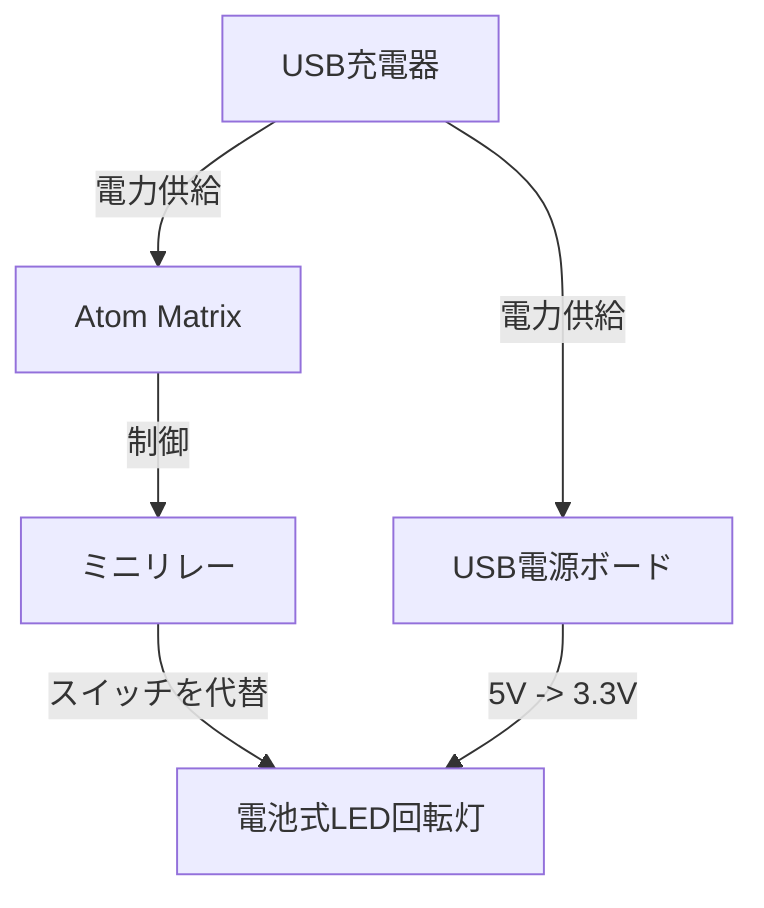
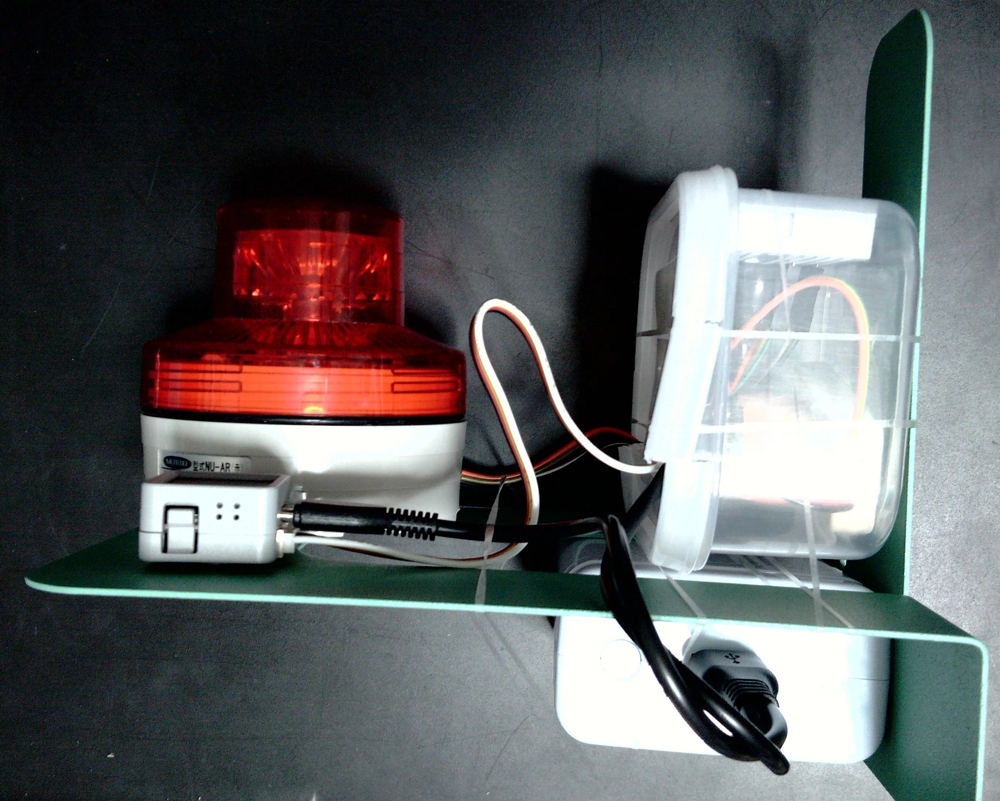
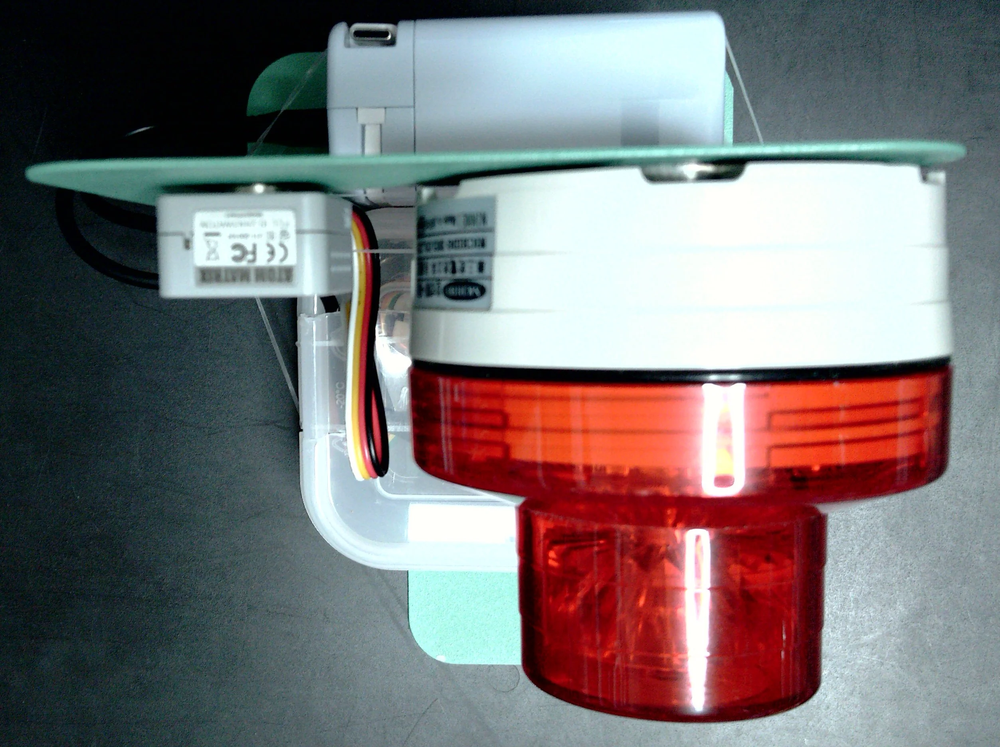
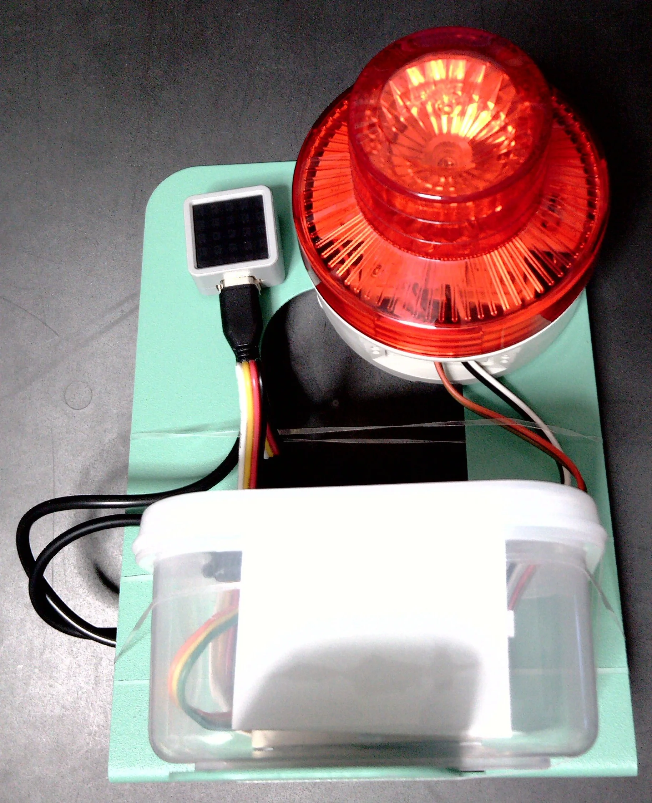
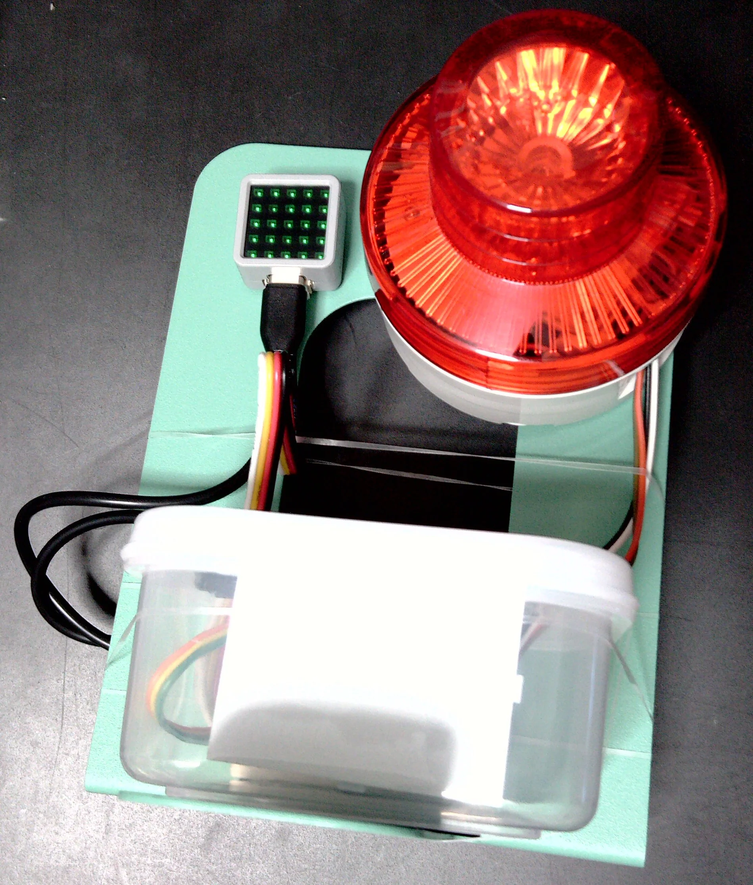
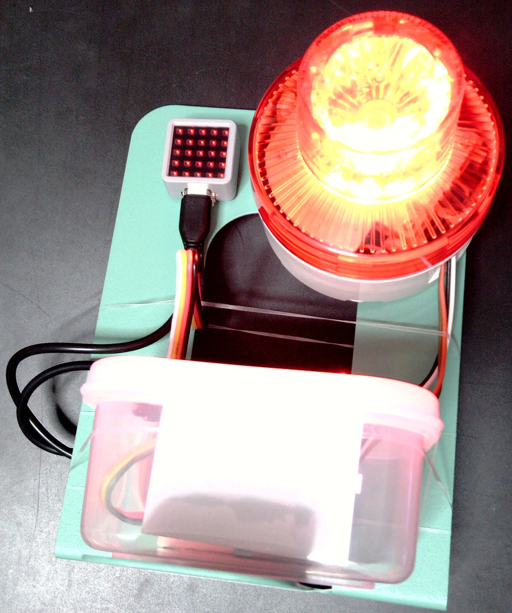
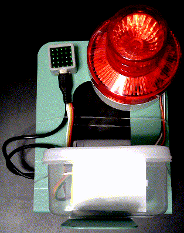

# M5 ATOM Matrix XFD

ATOM Matrix で 自作XFD (e<u>**X**</u>treme <u>**F**</u>eedback <u>**D**</u>evice)

## 主要な部品

- ATOM Matrix
  - 小型のマイコン。LED、ボタンがついていて、外装もあり気軽に利用できる。
  - https://docs.m5stack.com/ja/core/ATOM%20Matrix
  - https://www.switch-science.com/products/6260
- M5Stack用ミニリレーユニット
  - それなりの光量のLEDを制御するのでリレーを使う。
  - https://shop.m5stack.com/products/mini-3a-relay-unit
  - https://www.switch-science.com/products/4054
- 電池式LED回転灯
  - 単三電池二本で動作し、光量があり目立つライト。メカ接点のスイッチで改造しやすい。
  - https://www.nichido-ind.co.jp/products/sku/2008/
- ブレッドボード用USB電源ボード
  - 回転灯の電池交換が面倒なので、回転灯の電源もAtom Matrixと同じ電源から取得するために使う。
  - https://shop.sunhayato.co.jp/collections/educational-training/products/sbm-007

**上記製品の改造を推奨しているわけではありません。本文書を参考に作成する場合は自己責任でお願いします。**

## 構成図

## ソースコード

[./Arduino_IDE/M5Atom_Matrix_XFD/](./Arduino_IDE/M5Atom_Matrix_XFD/)

### 補足

1. `Arduino_IDE\M5Atom_Matrix_XFD\wifi_config.h.example` を元に`Arduino_IDE\M5Atom_Matrix_XFD\wifi_config.h` を作成し、環境に合わせて設定します。
2. サーバーに埋め込むHTMLである `Arduino_IDE/M5Atom_Matrix_XFD/index.html` を更新したら、環境に合わせて生成スクリプトを実行して `Arduino_IDE/M5Atom_Matrix_XFD/index_html.h` を更新します。
   - Windows PowerShell では `Arduino_IDE/M5Atom_Matrix_XFD/make_html.ps1` を実行します。
   - Linux / macOS / WSL では `Arduino_IDE/M5Atom_Matrix_XFD/make_html.sh` を実行します。

## 作例の写真

